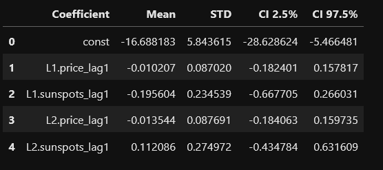
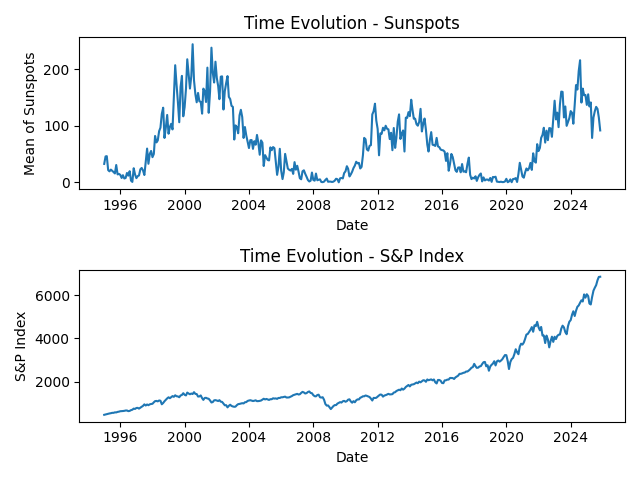
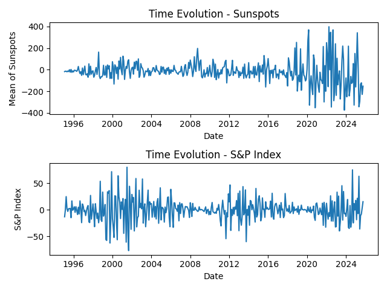
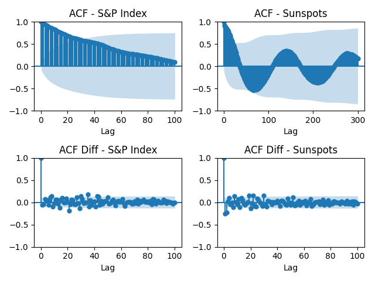
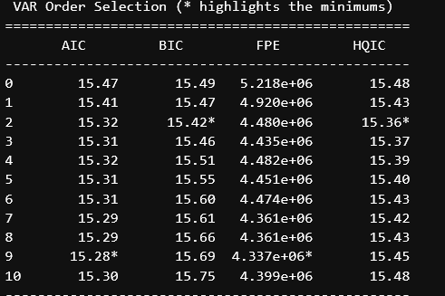
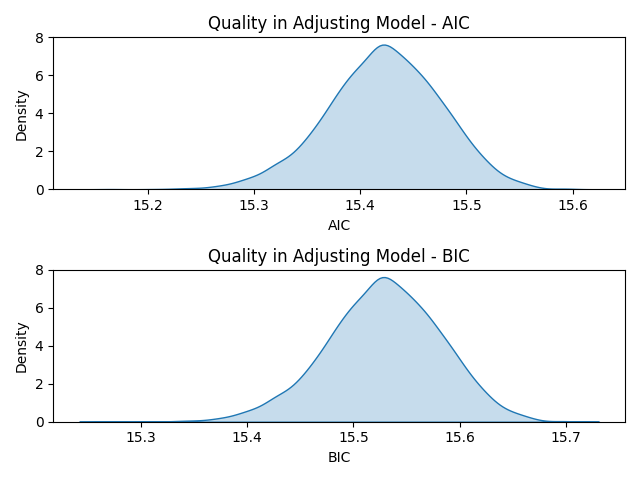
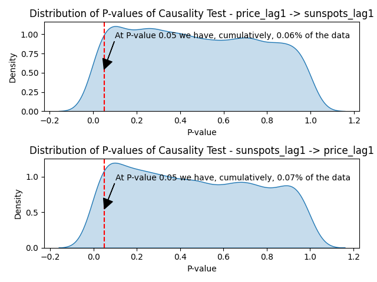
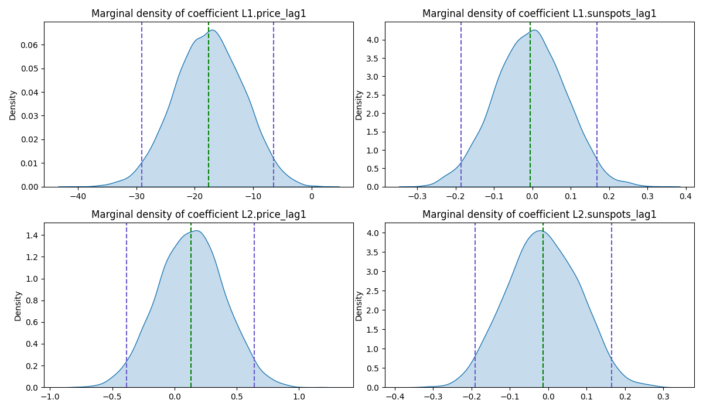
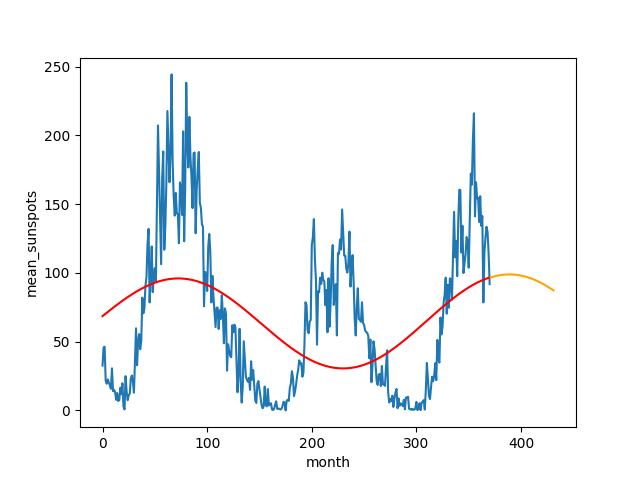

## 📈 Quantitative Time Series Analysis

### Overview
This project focuses on test the hypothesis that the solar activity can affect the aggregate risks preference (and, thereby, the S&P 500 Index) using quantitative techniques to identify statistical relationships and dependencies across time between them. 

### Methods

The project implements a set of quantitative techniques commonly used in time series analysis, including:

- Differencing to achieve stationarity
- Correlation and cross-correlation analysis
- Implementation of Vector Autoregressive Model to analyse dependencies along lags.
- Bootstrap Method to resample and refit models to robust inference.
- Causality Tests

### Inference

The metrics used to 

- Mean, variance and confidence intervals of the time series
- Correlation
- Stability and consistency metrics with Bootstrap Method

### About the Data

We collected S&P 500 Index via Web Scraping with Selenium and Python and Monthly Mean of Sunspots from [SIDC]([https://example.com](https://www.sidc.be/SILSO/datafiles))

#### S&P 500 Index

The temporal evolution of S&P 500 Index is a stochastic process with a trend but no seasonality.
We need to make the series stationary (and homoscedastic, if possible) in order to perform cross-validation

#### Mean of Sunspots
The temporal evolution appears to be a seasonal stationary process (there is no trend, but there are cycles)

#### Original Series

#### Differenced Series

### Analysis of Stationarity of the Series 

There is seasonality around lag 140 in the monthly mean sunspots series.
By first-order differencing, the series became stationary around the mean. However, the series exhibits variance that increases over time (heteroscedasticity).
Thus, we used a VAR model with robust errors to account for heteroscedasticity.

Based on the p-value, the original series are weakly stationary due we do reject the null hypothesis. For the differenced series, we do reject the null hypothesis at the significance level of 5%. I also used the PhillipsPerron because it supports heterocedasticity and the conclusion is the same.

### Correlation and cross-correlation analysis
For the stationary series (the differenced ones) $price\_lag1$ and $sunspots\_lag1$, we see a low correlation between them: 

#### Spearman Correlation
The metrics returned 0.018.
#### Pearson Correlation
The metrics returned -0.008.

#### Cross-correlation
There is some correlation between the stationary series at lower lags, however, these are few peaks and they are random, not being a strong statistical evidence of correlation. We used Granger-Causality test to assess possible causality.

### VAR Model

We used the bivariate VAR model to model the differenced series. The formula of the model is

$$
\begin{bmatrix}
\Delta y_t \\
\Delta x_t
\end{bmatrix}
= \sum_{i=1}^p \begin{bmatrix}
\alpha_{11,i} & \alpha_{12,i}  \\
\alpha_{21,i} & \alpha_{22,i}
\end{bmatrix}
\begin{bmatrix}
y_{1,t-i} \\
x_{2,t-i}
\end{bmatrix}
+
\begin{bmatrix}
u_{1,t} \\
u_{2,t}
\end{bmatrix}
$$

Considering $u_t$ as heterocedastic.

#### Choosing the Lag with AIC and BIC Metrics

The chosen lag was $p = 2$ due the lowest AIC and BIC values, thus representing the model that best captures changes in the dependent variables.
The AIC metric does not penalize the addiction of variables to the model, whereas BIC does.

Adjusting the model with lag 2, to explain the price_lag1 variable, the only signifficant coefficient in the model is sunspots_lag1 at the 2° lag with a p-value of 1%. 
Since there is heterocedasticity, we resampled the data to refit the model, allowing for more robust inference.

Then, we tested the causality with Granger causality F-test and our conclusion was that, based on the p-value, we did reject the null hypothesis that the lag 1 of sunspots does not cause the lag 1 of price and, thus, we have evidence from the data that there is some causality from sunspots_lag1 to price_lag1. From price_lag1 to sunspots_lag1, based on the p-value, we did not reject the null hypothesis that the lag 1 of price does not cause the lag 1 of sunspots and, thus, we have evidence from the data that there is not causality from price_lag1 to sunspots_lag1.

### Heterocedasticity Diagnosis

Under $H_0$, we have $\alpha_i = 0$ for all $i=1,...,p$ (there is not ARCH effect, i.e., it is homocedastic) and it follows a chi-squared distribution with $p$ degrees of freedom. In this case

$$
H_0:\alpha_i = 0 \text{ for all }i=1,...,p \text{ vs }H_1: \alpha_i \neq 0 \text{ for, at least, a }i 
$$

$$
T \sim \chi^2_2
$$

The test for both series returned large values, rejecting, then, the null hypothesis at any relevant significance level. Therefore, both series are heterocedastics and the bootstrap method will be used because it is robust to heterocedasticity.

### Bootstrap Method to Obtain Statistics

We used the Bootstrap Method to resample the data and refit models to get more statistics about the coefficients and, then, realize inference with more evidences. In the models, we resample the data 5000 times and checked the AIC and BIC metrics. The BIC and AIC metrics are not inconsistent across the models tested:

### Causality Hypothesis

$$
H_0: \text{Variable does not cause the other vs }H_1: \text{Variable does cause the other}
$$
As we see in the plots, the p-values of the causality tests are well distributed ABOVE 0,05% for both the series. We have a small proportion (9% and 11%) of tests that we do reject $H_0$, i.e., for 91% and 89% of the tests, we do not reject $H_0$ and, hence, there is statistical evidence of a non-causality between the tested variables.

### Marginal Density of Coefficients

### Statistics About Coefficients

The metrics below show that the coefficients may not be significant for the tested models, supporting the idea of non-causality.

### Conclusion

We modeled the difference in S&P 500 Index (named as price_lag1) against the difference in monthly mean sunspots (named as sunspots_lag1) and our conclusion is that there is neither correlation and causality between them, i.e., the difference in in monthly mean sunspots does not affect significantly the differente in S&P 500 Index. Therefore, I would not allocate capital to this signal.

### Plus

I modeled the temporal behavioral of Monthly Mean of Sunspots with periodic functions (sin and cos) and predicted the next 60 months. Considering the function

$$
f(t)=a_0+a_1\cos(a_3t)+a_2\sin(a_4t)
$$

As the model for the distribution and using the descendent gradient method with specifications:

$$t\in[0,2\pi]\\
\begin{array}{rl}
n & = & 50000 \quad \mbox{(Number of Iterations)}\\
h & = & 10^{-7} \quad \mbox{(Step size)}\\
[a^0_0,a^0_1,a^0_2,a^0_3,a^0_4] & = &[1,1,1,1,1] \quad \mbox{(Initial Condition)}
\end{array}
$$

We got the parameters:

$$
a_0 = 64.19754176  a_1 = 4.35949658 a_2 = 30.38020623  a3 = 0.97975145  a_4 = 1.18811425
$$

